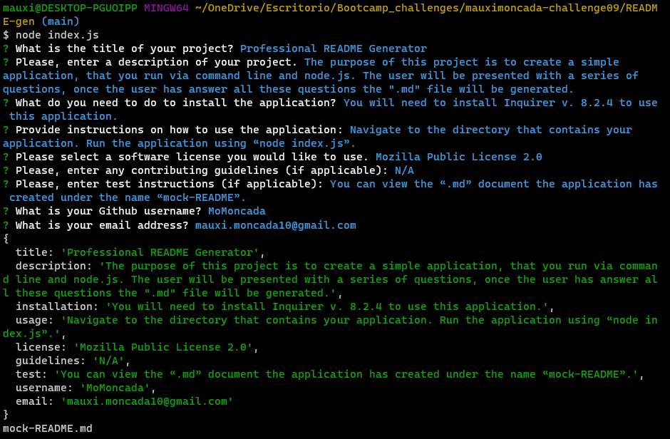

# README File Generator

## Description
The following application provides the user with a series of questions to generate a comprehensive README file, based on the user's input.

-------------------

## Instructions

[Click here to watch this application in action!](https://drive.google.com/file/d/1IlhpgfXNLZbplajFOCztbHE5UEWj5Ijv/view)

---------------------

## Installation

Clone the repository.

------

## Application Documentation

### GitHub: https://github.com/MoMoncada/README-gen
---------------------

## Application Screenshots
---------------------

### Q&A's via CLI

### Mock-README.md file

## Credits
Maria Auxiliadora Moncada 

------------

## License
N/A
